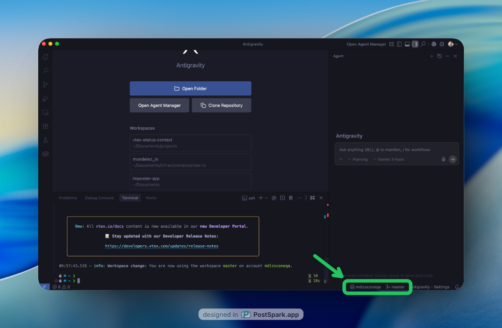

# Vtex Status Context

**Vtex Status Context** is a VS Code extension designed for VTEX developers. It provides real-time visibility of your current VTEX account and workspace directly in the status bar.

This extension works in partnership with the [VTEX Toolbelt](https://github.com/vtex/toolbelt). It monitors your local VTEX session and automatically updates whenever you switch accounts or workspaces via the CLI.

## ✨ Features

- **Real-time Monitoring**: Automatically detects changes in your VTEX session.
- **Workspace Visibility**: Shows the current workspace name with a git-branch icon.
- **Account Information**: Displays the logged-in account and user.
- **Lightweight & Fast**: Uses native OS events to monitor changes with minimal resource impact.
- **Zero Configuration**: Works out of the box if you have VTEX Toolbelt installed.

## 🚀 Prerequisites

Before using this extension, ensure you have:
1.  **VTEX Toolbelt** installed and configured.
2.  An active session (logged in via `vtex login`).

## 📥 Installation

### From Marketplace
Search for **"Vtex Status Context"** in the VS Code Extensions view and click **Install**.

### Using VSIX (Offline/Manual)
If you have a `.vsix` file:
1.  Open the **Extensions** view in VS Code (`Ctrl+Shift+X`).
2.  Click on the **three dots** (`...`) in the top-right corner.
3.  Select **"Install from VSIX..."**.
4.  Choose the `.vsix` file.

To generate the VSIX yourself:
1.  Install the CLI: `npm install -g @vscode/vsce`
2.  Run: `vsce package`

### Manual Installation (Development)
1. Clone this repository.
2. Run `npm install` to install dependencies.
3. Press `F5` to run the extension in a development host.

## 📖 Usage

1.  Open any project in VS Code.
2.  If you are logged into VTEX, look at the **Status Bar** (bottom right).
3.  You will see two new items:
    - `$(git-merge) {workspace}`: Your current VTEX workspace.
    - `$(account) {account}`: Your current VTEX account.
4.  When you run `vtex use` or `vtex login` in your terminal, the status bar will update automatically.

## 🛠️ Development

If you want to contribute or modify the extension:

- **Compile**: `npm run compile`
- **Watch mode**: `npm run watch`
- **Lint**: `npm run lint`

## 📄 License

This project is licensed under the MIT License.
